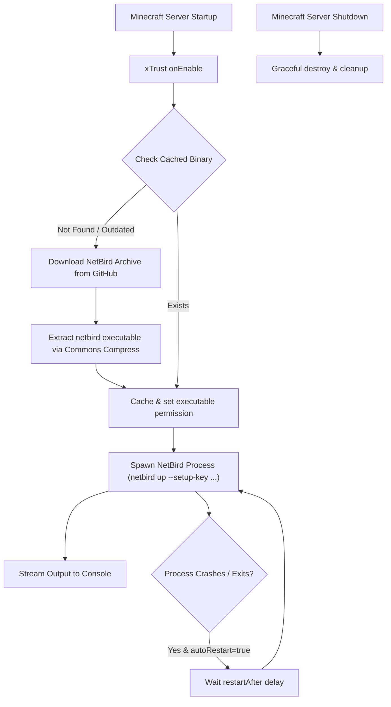

<div align="center">

# 🛡️ xTrust

**Seamless Zero-Trust Mesh Networking for Paper & Folia Minecraft Servers via NetBird**

[](https://openjdk.org/)
[](https://kotlinlang.org/)
[](https://papermc.io/)
[](https://netbird.io/)
[](LICENSE)

[English](README.md) • [Tiếng Việt](README.vi.md)

</div>

---

## 📌 Overview

**xTrust** is a lightweight, high-performance Minecraft server plugin designed for **Paper** and **Folia**. It bridges your Minecraft server instance directly into a private, encrypted [NetBird](https://netbird.io/) Zero-Trust WireGuard-based mesh network during server initialization (`load: STARTUP`).

By joining a NetBird mesh network, your Minecraft server instances can communicate securely across different datacenters, cloud providers, and VPS nodes without exposing public ports, configuring complicated firewall rules, or dealing with port forwarding.

---

## ✨ Features

- 🌐 **Zero-Trust Private Mesh**: Connects your server to your NetBird overlay network seamlessly using a NetBird setup key.
- ⚡ **Folia & Paper Native**: Built on [FoliaLib](https://github.com/TechnicJelle/FoliaLib) to guarantee safe asynchronous task execution compatible with both Paper and Folia's multi-threaded regional ticking architecture.
- 📦 **Automated CLI Management**:
  - Automatically downloads the NetBird client binary from official GitHub releases.
  - In-stream `.tar.gz` archive extraction powered by Apache Commons Compress (no external tools required).
  - Caches the binary locally (`.cache/xtrust/netbird/`) to prevent redundant downloads across server restarts.
  - Automatically handles Linux file execution permissions (`chmod +x`).
- 🔄 **Supervisor & Auto-Restart**:
  - Automatically spawns `netbird up` with your configured setup key.
  - Streams and logs NetBird output asynchronously to the server console (`[NetBird] ...`).
  - Monitors daemon health with automatic retry and restart upon unexpected exit or crash.
- 🛑 **Clean Lifecycle & Graceful Shutdown**:
  - Safely stops the NetBird process during server shutdown.
  - Enforces cleanup with fallback forced termination and lingering process cleanup (`pkill`).
- 🛠️ **Relocated Dependencies**: All internal libraries (`FoliaLib`, `commons-compress`) are shadowed and relocated under `me.orius.xtrust.lib.*` to prevent classpath conflicts with other plugins.
- ⚙️ **Type-Safe Configuration**: Configuration managed using `configlib-yaml` with clean kebab-case formatting (`plugins/xTrust/netbird.yml`).

---

## 🏗️ Architecture & Workflow



---

## 🎯 Use Cases

- **Cross-Node Server Networks**: Connect Velocity / BungeeCord proxies and backend Paper / Folia servers hosted in different regions/cloud providers via private, encrypted WireGuard tunnels without exposing backend ports to the public internet.
- **Secure Remote Services**: Allow Minecraft servers to connect directly to private databases (MySQL, Redis, PostgreSQL) or internal microservices over a private subnet.
- **Private Operator / Staff Access**: Restrict direct server access or management endpoints exclusively to authorized NetBird peers.

---

## 📋 Requirements

| Requirement | Supported Version |
|-------------|-------------------|
| **Java** | OpenJDK 25+ |
| **Server Platform** | Paper / Folia (Minecraft 1.20+ / API 26.2+) |
| **Operating System** | Linux (amd64 / x86_64) recommended *(standard for Minecraft servers, Docker, and Pterodactyl)* |
| **NetBird Account** | [NetBird Cloud](https://app.netbird.io/) or self-hosted NetBird management server |

---

## 🚀 Quick Start

1. **Build or Download**: Obtain the latest `xTrust-1.0-all.jar`.
2. **Install**: Place `xTrust-1.0-all.jar` into your server's `plugins/` directory.
3. **Generate Config**: Start the server once, then stop it. A configuration file will be created at:
   ```
   plugins/xTrust/netbird.yml
   ```
4. **Configure Setup Key**:
   - Open your NetBird management dashboard and create a **Setup Key**.
   - Paste the setup key into `plugins/xTrust/netbird.yml`:
     ```yaml
     setup-key: "YOUR_NETBIRD_SETUP_KEY"
     ```
5. **Start Server**: Launch your Minecraft server. Check console logs for `[NetBird]` to verify connection.

---

## ⚙️ Configuration (`netbird.yml`)

```yaml
# NetBird binary download settings
download:
  # URL template for fetching the NetBird client archive
  url: "https://github.com/netbirdio/netbird/releases/download/v{VERSION}/netbird_{VERSION}_linux_amd64.tar.gz"
  # Version of NetBird client to download
  version: "0.79.0"
  # Directory where the NetBird executable is cached
  cache-dir: ".cache/xtrust/netbird"

# Your NetBird pre-authenticated Setup Key from NetBird dashboard
setup-key: "AAAAAAAAAAAA"

# Process monitoring and auto-restart policy
restart:
  # Whether to restart NetBird automatically if it exits unexpectedly
  auto-restart: true
  # Delay (in seconds) before attempting a restart
  restart-after: 30
```

### Configuration Options Explained

- **`download.url`**: URL template pointing to the NetBird release `.tar.gz`. `{VERSION}` is dynamically substituted.
- **`download.version`**: The target NetBird release version (e.g. `0.79.0`).
- **`download.cache-dir`**: Local storage path for the extracted binary. Can be relative to the server root or plugin directory.
- **`setup-key`**: The one-time or reusable setup key used to enroll the server peer into your NetBird network.
- **`restart.auto-restart`**: Enables automatic process re-launch if the connection or daemon drops.
- **`restart.restart-after`**: Number of seconds to wait before attempting to restart the NetBird process.

---

## ⌨️ Commands & Permissions

All commands are registered via **CommandAPI** with full Brigadier tab-completion and permission checks.

### Commands

| Command | Permission | Description |
|---------|------------|-------------|
| `/xtrust` *(or `/xt`)* | `xtrust.admin` | Displays plugin version and command overview. |
| `/xtrust reload` | `xtrust.command.reload` | Reloads all configuration files (`netbird.yml`). |
| `/xtrust reload config` | `xtrust.command.reload` | Reloads configuration files. |
| `/xtrust reload netbird` | `xtrust.command.reload` | Restarts the NetBird daemon asynchronously. |
| `/xtrust reload all` | `xtrust.command.reload` | Reloads configuration and restarts NetBird. |

### Permissions

- `xtrust.admin`: Grants access to root `/xtrust` command.
- `xtrust.command.reload`: Allows reloading configurations and restarting the NetBird service.

---

## 🛠️ Building From Source

### Prerequisites
- JDK 25 installed
- Git

### Build Instructions

Clone the repository:
```bash
git clone https://github.com/your-username/xTrust.git
cd xTrust
```

Build the shaded JAR:
```bash
# On Linux / macOS
./gradlew build

# On Windows (PowerShell)
.\gradlew.bat build
```

The resulting plugin JAR will be located at:
```
build/libs/xTrust-1.0-all.jar
```

### Running the Test Server

You can run a local Paper test server with the plugin automatically loaded via `run-paper`:
```bash
./gradlew runServer
```

### Running Unit Tests

```bash
./gradlew test
```

---

## 📦 Dependencies & Relocations

To avoid dependency clashes, the following libraries are shaded and relocated:

| Library | Original Package | Relocated Package |
|---------|-----------------|-------------------|
| **FoliaLib** | `com.tcoded.folialib` | `me.orius.xtrust.lib.folialib` |
| **Apache Commons Compress** | `org.apache.commons.compress` | `me.orius.xtrust.lib.commons.compress` |
| **CommandAPI** | `dev.jorel.commandapi` | `me.orius.xtrust.lib.commandapi` |

---

## 👤 Author

- **_Orius** - Developer

---

## 📄 License

This project is licensed under the MIT License - see the [LICENSE](LICENSE) file for details.
