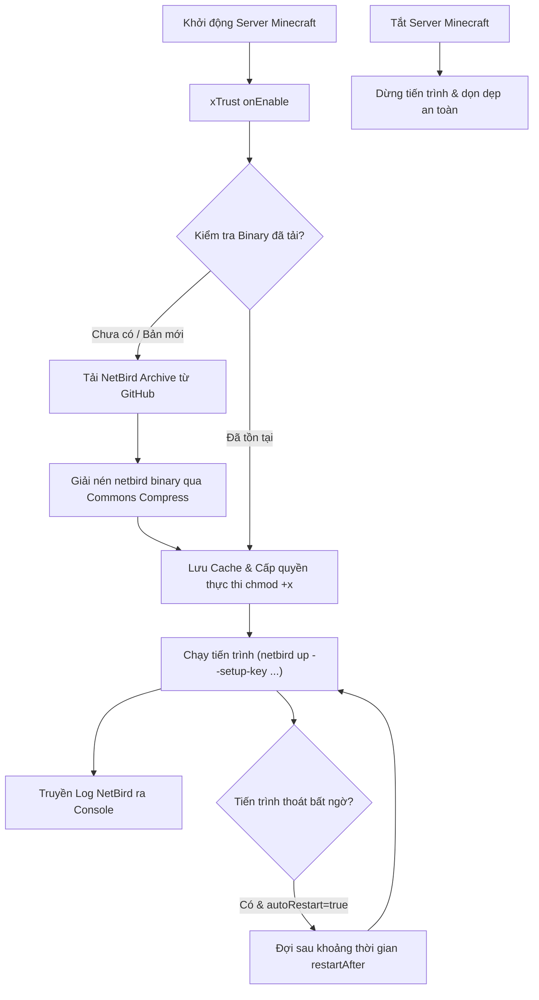

<div align="center">

# 🛡️ xTrust

**Tích hợp mạng riêng ảo Zero-Trust Mesh (NetBird) cho máy chủ Minecraft Paper & Folia**

[](https://openjdk.org/)
[](https://kotlinlang.org/)
[](https://papermc.io/)
[](https://netbird.io/)
[](LICENSE)

[English](README.md) • [Tiếng Việt](README.vi.md)

</div>

---

## 📌 Giới thiệu tổng quan

**xTrust** là plugin Minecraft server hiệu năng cao dành cho nền tảng **Paper** và **Folia**. Plugin cho phép kết nối máy chủ Minecraft trực tiếp vào mạng lưới VPN phân tán [NetBird](https://netbird.io/) (Zero-Trust Mesh Network nền tảng WireGuard) ngay trong giai đoạn khởi động máy chủ (`load: STARTUP`).

Với xTrust, các cụm máy chủ Minecraft có thể giao tiếp an toàn, bảo mật giữa các cụm máy chủ / VPS / Data Center khác nhau mà không cần mở port ra ngoài internet, không lo rò rỉ địa chỉ IP thật của backend và giảm thiểu tối đa nguy cơ bị tấn công mạng (DDoS, khai thác cổng dịch vụ).

---

## ✨ Tính năng nổi bật

- 🌐 **Mạng Zero-Trust nội bộ**: Kết nối trực tiếp vào mạng riêng NetBird của bạn chỉ với một khóa kích hoạt (`setup-key`).
- ⚡ **Hỗ trợ tối ưu Folia & Paper**: Tích hợp [FoliaLib](https://github.com/TechnicJelle/FoliaLib), đảm bảo thực thi tác vụ bất đồng bộ (async) hoàn toàn an toàn trên cả Paper và cấu trúc đa luồng theo vùng (regionized threading) của Folia.
- 📦 **Tự động quản lý NetBird CLI**:
  - Tự động tải bản binary NetBird chính thức từ GitHub Releases khi khởi động nếu chưa có.
  - Giải nén tệp `.tar.gz` ngay qua luồng dữ liệu (in-stream) với Apache Commons Compress mà không yêu cầu máy chủ cài sẵn công cụ giải nén bên ngoài.
  - Lưu trữ đệm (cache) binary tại `.cache/xtrust/netbird/`, tự động dọn dẹp các tệp tạm và cấp quyền thực thi (`chmod +x`).
- 🔄 **Giám sát & Tự động khởi động lại (Auto-Restart)**:
  - Khởi chạy tiến trình `netbird up --setup-key ...` ngầm.
  - Chuyển hướng log đầu ra của NetBird trực tiếp về bảng điều khiển server console (`[NetBird] ...`).
  - Theo dõi trạng thái tiến trình, tự động kích hoạt tiến trình chạy lại khi bị ngắt kết nối hoặc gặp sự cố bất ngờ.
- 🛑 **Vòng đời an toàn (Graceful Shutdown)**:
  - Tự động ngắt kết nối và đóng tiến trình NetBird một cách an toàn khi server dừng hoặc khởi động lại.
  - Tự động dọn dẹp các tiến trình mồ côi (`pkill`).
- 🛠️ **Cách ly phụ thuộc (Shaded & Relocated)**: Toàn bộ thư viện bên ngoài (`FoliaLib`, `commons-compress`) đều được relocate sang gói `me.orius.xtrust.lib.*`, tránh xung đột classpath với các plugin khác.
- ⚙️ **Cấu hình trực quan**: Sử dụng định dạng YAML dạng lower-kebab-case thông qua thư viện `configlib-yaml`.

---

## 🏗️ Luồng hoạt động của hệ thống



---

## 🎯 Các trường hợp ứng dụng thực tế

- **Cụm máy chủ phân tán (Multi-Server / Cross-VPS)**: Kết nối các proxy như Velocity, BungeeCord tới các cụm máy chủ backend (Paper/Folia) nằm ở các nhà cung cấp VPS/Dedicated server khác nhau qua đường hầm mã hóa WireGuard mà không cần mở port backend ra ngoài Internet.
- **Bảo mật kết nối dịch vụ & cơ sở dữ liệu**: Kết nối an toàn đến database từ xa (MySQL, MariaDB, Redis, MongoDB) hoặc các API nội bộ qua dải mạng riêng NetBird.
- **Mạng riêng cho ban quản trị / Staff**: Chỉ cho phép ban quản trị truy cập vào server nội bộ thông qua các IP được cấp phép trong mạng NetBird.

---

## 📋 Yêu cầu môi trường

| Thành phần | Yêu cầu |
|------------|---------|
| **Java** | OpenJDK 25+ |
| **Server Platform** | Paper / Folia (Minecraft 1.20+ / API 26.2+) |
| **Hệ điều hành** | Linux (amd64 / x86_64) *(môi trường tiêu chuẩn của các VPS, máy chủ máy ảo, Docker, Pterodactyl)* |
| **Tài khoản NetBird** | [NetBird Cloud](https://app.netbird.io/) hoặc máy chủ NetBird tự host (Self-hosted) |

---

## 🚀 Hướng dẫn cài đặt nhanh

1. **Chuẩn bị file**: Tải hoặc biên dịch file `xTrust-1.0-all.jar`.
2. **Cài đặt plugin**: Đặt `xTrust-1.0-all.jar` vào thư mục `plugins/` của máy chủ.
3. **Tạo file cấu hình**: Khởi động server một lần rồi tắt đi. File cấu hình sẽ được tạo tại:
   ```
   plugins/xTrust/netbird.yml
   ```
4. **Điền Setup Key**:
   - Truy cập vào bảng quản trị NetBird và tạo một **Setup Key**.
   - Dán setup key vào file `plugins/xTrust/netbird.yml`:
     ```yaml
     setup-key: "YOUR_NETBIRD_SETUP_KEY"
     ```
5. **Khởi động server**: Bật máy chủ Minecraft. Kiểm tra log console xuất hiện các dòng tiền tố `[NetBird]` để xác nhận kết nối thành công.

---

## ⚙️ Giải thích cấu hình (`netbird.yml`)

```yaml
# Cấu hình tải NetBird binary
download:
  # Đường dẫn mẫu tải file nén NetBird
  url: "https://github.com/netbirdio/netbird/releases/download/v{VERSION}/netbird_{VERSION}_linux_amd64.tar.gz"
  # Phiên bản NetBird cần tải
  version: "0.79.0"
  # Thư mục lưu trữ binary đã giải nén
  cache-dir: ".cache/xtrust/netbird"

# Setup Key lấy từ trang quản trị NetBird
setup-key: "AAAAAAAAAAAA"

# Cơ chế tự động khởi động lại tiến trình
restart:
  # Bật/tắt tự động khởi động lại khi tiến trình NetBird bị dừng đột ngột
  auto-restart: true
  # Thời gian chờ (tính bằng giây) trước khi thử khởi động lại
  restart-after: 30
```

---

## ⌨️ Lệnh & Quyền hạn (Commands & Permissions)

Toàn bộ lệnh được đăng ký thông qua **CommandAPI**, hỗ trợ đầy đủ gợi ý lệnh (Brigadier tab-completion) và phân quyền chặt chẽ.

### Danh sách lệnh

| Lệnh | Quyền hạn | Mô tả |
|------|-----------|-------|
| `/xtrust` *(hoặc `/xt`)* | `xtrust.admin` | Hiển thị thông tin phiên bản và trợ giúp lệnh. |
| `/xtrust reload` | `xtrust.command.reload` | Tải lại (reload) toàn bộ tệp cấu hình (`netbird.yml`). |
| `/xtrust reload config` | `xtrust.command.reload` | Tải lại các tệp cấu hình plugin. |
| `/xtrust reload netbird` | `xtrust.command.reload` | Khởi động lại daemon NetBird (chạy ngầm bất đồng bộ). |
| `/xtrust reload all` | `xtrust.command.reload` | Tải lại toàn bộ cấu hình và khởi động lại NetBird. |

### Danh sách quyền hạn

- `xtrust.admin`: Quyền sử dụng lệnh gốc `/xtrust`.
- `xtrust.command.reload`: Quyền thực thi lệnh reload cấu hình và khởi động lại dịch vụ NetBird.

---

## 🛠️ Biên dịch từ mã nguồn

### Yêu cầu
- Đã cài đặt JDK 25
- Git

### Các lệnh biên dịch

Sao chép mã nguồn về máy:
```bash
git clone https://github.com/your-username/xTrust.git
cd xTrust
```

Biên dịch plugin (Shadow JAR):
```bash
# Trên Linux / macOS
./gradlew build

# Trên Windows (PowerShell)
.\gradlew.bat build
```

File sau khi build xong sẽ nằm tại:
```
build/libs/xTrust-1.0-all.jar
```

### Chạy thử nghiệm với Run-Paper
```bash
./gradlew runServer
```

### Chạy Unit Test
```bash
./gradlew test
```

---

## 📦 Danh sách thư viện nhúng (Relocations)

Để đảm bảo không bị xung đột phiên bản với các plugin khác, các thư viện phụ thuộc được đóng gói và đổi tên:

| Thư viện | Gói gốc | Gói sau khi chuyển hướng |
|---------|---------|-------------------------|
| **FoliaLib** | `com.tcoded.folialib` | `me.orius.xtrust.lib.folialib` |
| **Apache Commons Compress** | `org.apache.commons.compress` | `me.orius.xtrust.lib.commons.compress` |
| **CommandAPI** | `dev.jorel.commandapi` | `me.orius.xtrust.lib.commandapi` |

---

## 👤 Tác giả

- **_Orius** - Developer

---

## 📄 Giấy phép (License)

Dự án được phân phối dưới giấy phép [MIT License](LICENSE).
